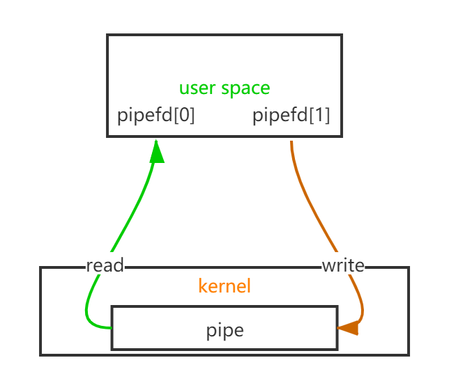
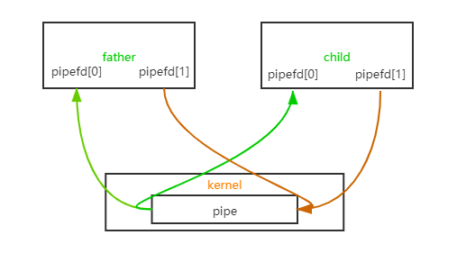

# 进程间通信之无名管道

> *版权声明：*
>
> *本文章内容在非商业使用前提下可无需授权任意转载、发布；*
> *转载、发布请务必注明作者和原文地址。*
>
> *作者：南极熊club*
> *微信公众号：南极熊club*

----

> `linux`进程间通信方式(`posix IPC`)：
>
> - **无名管道**；
> - 命名管道；
> - 消息队列；
> - 信号；
> - 信号量；
> - 共享内存；
> - 网络通信；
>
> 本文介绍`linux`下进程间通信方式之一的无名管道。

## 概述

> - 无名管道具有半双工、单向的特性，只能一端写，一端读；
> - 无名管道仅仅用于有亲缘关系的父子进程之间，因为管道没有名称，所以只能通过子进程继承的方式从父进程获取管道的句柄；
> - `linux`中无名管道使用的场景非常多，例如绝大部分`shell`程序都支持管道，命令行中使用`|`方式将前一个命令的输出通过管道给到后一个命令。

实际上管道的实现是在内存中分配的空间用于存储数据，但是使用时具有部分和普通文件相同的特性：文件描述符(命名管道甚至能在磁盘中查看到具体文件，下一章将介绍)、read/write/fcntl可用，所以在实际的使用过程比较简单。

## 无名管道细节讲解

**创建无名管道：**

```c
int pipe(int pipefd[2]);
```

- `int pipefd[2]`：参数为2个长度的数组，用于存放管道创建成功时读和写的描述符，[0]用于读，[1]用于写；
- 返回值0为成功，-1为异常。

[0]用于读，[1]用于写是由于无名管道的特性引起的(先入先出，半双工)，简单模型如下：


不过实际使用中一般用于父子继承间通信，`pipefd[2]`父子进程各有一对：


**注意：在用于父子进程中通信时，确保父子进程仅有一方读，另一方写，不要父或子对同一个管道既可写又可读，如父进程写入数据，子进程读出数据，那么父进程应该将读端pipefd[0]关闭，子进程应该将写端pipefd[1]关闭。如果需要父子进程双向通信，应该另外创建一个管道。原因是无名管道是半双工的，避免同时读写造成数据混乱。**

双向通信模型：
<!--TODO-->

**关闭描述符**：

和普通文件一样使用`close()`进行关闭：

```c
close(pipefd[0]);
close(pipefd[1]);
```

**管道读写：**

**设置阻塞，非阻塞：**

**管道大小限制与原子性：**

**编程示例：**

## 使用场景
