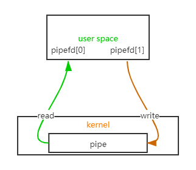

# 进程间通信之无名管道

> *自信、冷静、专注。  —— TM熊的自我勉励*

----

> `linux`进程间通信方式：
>
> - **无名管道**；
> - 命名管道；
> - 消息队列；
> - 信号；
> - 信号量；
> - 共享内存；
> - 网络通信；
>
> 本文介绍`linux`下进程间通信方式之一的无名管道。

## 概述

**什么是管道？**

> 想象下水管，水从一端流向另一端，正常情况下是不是只能从一端流入，一端流出。


管道又分为：

- 无名管道
- 有名管道

即使对无名管道不是很了解，但是在你使用`linux`系统命令时应该经常接触到的，就是命令之间用于传递上个命令结果到下个命令作为参数的`|`符号：

```shell
ps -aux | grep init
```

而无名管道与有名管道最直观的区别在于**有名管道**能在文件系统中找到对应类型的文件，举个例子：

```shell
$ mkfifo /tmp/tpipe

$ ls -l /tmp/tpipe

prw-r--r-- 1 wotsen wotsen 0 Oct 25 10:20 /tmp/tpipe
```

其中查看文件类型时，前面的`p`标志就代表它是一个**管道文件**。

在一个终端内进行写：

```shell
$ echo "hello pipe" > /tmp/tpipe
```

在另一个终端内进行读取：

```shell
$ cat /tmp/tpipe

hello pipe
```

## 无名管道

> 管道文件也是一种文件，那么我们写管道、读管道也就是读写文件。
> 无名管道，顾名思义则是没有名称的管道文件，只存在内存中，有名管道则能在文件系统内查看到其名称。

**无名管道特性：**

> - 无名管道具有半双工、单向的特性，只能一端写，一端读；
> - 无名管道仅仅用于有亲缘关系的父子进程之间，**你可以理解为因为管道没有名称，所以只能通过子进程继承的方式从父进程获取管道的句柄(文件描述符)**；
> - `linux`中无名管道使用的场景非常多，例如绝大部分`shell`程序都支持管道，命令行中使用`|`方式将前一个命令的输出通过管道给到后一个命令。

管道的实现是在内存中分配的空间用于存储数据，但是使用时具有部分和普通文件相同的特性：文件描述符、`read/write/fcntl`可用，所以在实际的使用过程比较简单。

## 无名管道API

**创建无名管道：**

```c
#include <unistd.h>

int pipe(int pipefd[2]);
```

- `int pipefd[2]`：参数为2个长度的数组，用于存放管道创建成功时读和写的描述符，[0]用于读，[1]用于写；
- 返回值0为成功，-1为异常。

*Tips*:如果不记得函数详细说明，可以使用`man`命令查看，`ubuntu`安装`man`手册：

```shell
apt-get install manpages-de  manpages-de-dev  manpages-dev glibc-doc manpages-posix-dev manpages-posix
```

管道文件描述符中[0]用于读，[1]用于写，这是由于无名管道的特性引起的(先入先出，半双工，那么得规定哪端入，哪端出)，简单模型如下：


不过实际使用中一般用于父子继承间通信，`pipefd[2]`父子进程各有一对：


**注意：在用于父子进程中通信时，确保父子进程仅有一方读，另一方写，不要父或子对同一个管道既可写又可读。如果父进程用于写入数据，子进程则用于读出数据，并且父进程应该将读端pipefd[0]关闭，子进程应该将写端pipefd[1]关闭。如果需要父子进程双向通信，应该另外创建一个管道(一对)。原因是无名管道是半双工的，避免同时读写造成数据混乱。**

父子进程的双向通信模型：


**关闭描述符**：

和普通文件一样使用`close()`进行关闭：

```c
int close(int fd);

close(pipefd[0]);
close(pipefd[1]);
```

**管道读写：**

前面说过，管道的读写同文件读写一样，使用`read/write`即可：

```c
ssize_t read(int fd, void *buf, size_t count);
ssize_t write(int fd, const void *buf, size_t count);

read(pipefd[0], buf, count);
write(pipefd[1], buf, count);
```

**设置阻塞，非阻塞：**

创建管道时默认是阻塞的，不过使用`fcntl`来设置，设置阻塞时将对应的标记为置为`~O_NONBLOCK`，非阻塞时为`O_NONBLOCK`：

```c
int fcntl(int fd, int cmd, ... /* arg */ );

bool set_fd_block(const int fd, const bool en) {
	int flag = fcntl(fd, F_GETFL, 0);
	if (flag < 0) { return false; }

	if (en) { ///< 设置阻塞
		flag &= ~O_NONBLOCK;
	} else { ///< 设置非阻塞
		flag |= O_NONBLOCK;
	}

	return fcntl(fd, F_SETFL, flag) == 0;
}
```

**管道大小限制与原子性：**

> 由于无名管道使用的是内核中的缓存，既然是缓存，必定存在大小限制，在不读取的情况下不可能无限地写入。

`PIPE_SIZE`：管道的最大大小，以下方式可以查看：

- 可以查看内核代码文件`include/linux/pipe_fs_i.h`，其中有详细的关于无名管道的定义，`#define PIPE_SIZE PAGE_SIZE`，为一页大小；
- `/proc/sys/fs/pipe-max-size`，可以直接打印大小；
- 使用`fcntl`查看，选项为`F_GETPIPE_SZ`，也可以使用`F_SETPIPE_SZ`来设置：
  ```c
  fcntl(fd, F_SETPIPE_SZ, size);
  size = fcntl(fd, F_GETPIPE_SZ);
  ```

> 原子性：主要是使用`write`在写入管道数据时需要保证指定长度的数据一定是写入成功或者写入失败的，并且写入的数据一定是保持原本的完整性(不会出现前一段数据和后一段数据被分割)。

`PIPE_BUF`：该值的含义是一次性写入管道的最大数据大小限制，影响着管道数据写入的原子性，该值`Posix`规定至少为512，详细说明下该值的影响：

1. 待写入的数据长度小于等于`PIPE_BUF`：
   - 如果管道剩下空间能够容纳，则直接写入；
   - 如果剩下的空间不够，即使设置了非阻塞，都会直接返回`EAGAIN`错误；
2. 写入的数据长度大于`PIPE_BUF`：
   - 如果管道有剩余空间，就写入管道能容纳下的数据，并且返回成功写入的数据长度，比如管道剩余520字节，需要写入530字节，则会成功写入前520字节；
   - 如果管道没有任何剩余空间，直接返回`EAGAIN`错误；

前面有提到管道也可以设置阻塞和非阻塞，但是在管道剩余空间足够的情况下，`write`操作是不受影响的。

**编程示例：**

```c
#include <time.h>
#include <stddef.h>
#include <unistd.h>
#include <fcntl.h>
#include <stdexcept>
#include <string.h>
#include <errno.h>
#include <sys/types.h>

typedef int pipe_t;

/**
 * @brief pipe管道
 * @details 半双工，只能用于父子进程，一端只能读，一端只能写
 */
class Pipe
{
public:
	Pipe();
	~Pipe();

	// 读取
	int read(void* data, const size_t len, const time_t wait=0);
	// 写入
	int write(const void* data, const size_t len, const time_t wait=0);
	// 关闭全部
	void close(void);

	// 关闭读端
	void close_r(void);
	// 关闭写端
	void close_w(void);

	// 设置管道容量
	bool set_size(const size_t &size);

	/**
	 * @brief 设置阻塞
	 * 
	 * @param en true-阻塞，false-非阻塞
	 * @return true 成功
	 * @return false 失败
	 */
	bool set_block(const bool en);

	// 获取读端描述符
	pipe_t read_fd(void);
	// 获取写端描述符
	pipe_t write_fd(void);
private:
	pipe_t pipe_[2];
};

bool set_fd_block(const int fd, const bool en) {
	int flag = fcntl(fd, F_GETFL, 0);
	if (flag < 0) { return false; }

	if (en) { ///< 阻塞
		flag &= ~O_NONBLOCK;
	} else { ///< 非阻塞
		flag |= O_NONBLOCK;
	}

	return fcntl(fd, F_SETFL, flag) == 0;
}

Pipe::Pipe() {
	pipe_[0] = -1;
	pipe_[1] = -1;

    // 创建管道
	if (pipe(pipe_) < 0) {
		throw std::runtime_error("open pipe error");
	}
}

Pipe::~Pipe(void) {
	close();
}

void Pipe::close_r(void)
{
	if (pipe_[0] >= 0) {
        // 关闭读端
		::close(pipe_[0]);
	}

	pipe_[0] = -1;
}

void Pipe::close_w(void)
{
	if (pipe_[1] >= 0) {
        // 关闭写端
		::close(pipe_[1]);
	}

	pipe_[1] = -1;
}

void Pipe::close(void) {
	close_w();
	close_r();
}

bool Pipe::set_size(const size_t &size) {
	if (pipe_[0] < 0 && pipe_[1] < 0) { return false; }

    // 只对一个有效的描述符进行操作
    if (pipe_[0] >= 0) {
	    return 0 == fcntl(pipe_[0], F_SETPIPE_SZ, size);
    } else if (pipe_[1] >= 0) {
	    return 0 == fcntl(pipe_[1], F_SETPIPE_SZ, size);
    } else {
        return false;
    }
}

bool Pipe::set_block(const bool en) {
    // 只对一个有效的描述符进行操作
	if (pipe_[0] >= 0) {
		if (set_fd_block(pipe_[0], en)) {
			return true;
		}
		return false;
	}

	if (pipe_[1] >= 0) {
		if (set_fd_block(pipe_[1], en)) {
			return true;
		}
		return false;
	}

	return false;
}

pipe_t Pipe::read_fd(void) {
	return pipe_[0];
}

pipe_t Pipe::write_fd(void) {
	return pipe_[1];
}

int Pipe::write(const void* data, const size_t len, const time_t wait) {
	if (pipe_[1] < 0) { return -1; }

	return ::write(pipe_[1], data, len);
}

int Pipe::read(void* data, const size_t len, const time_t wait) {
	if (pipe_[0] < 0) { return -1; }

	return ::read(pipe_[0], data, len);
}

int main(void) {
    Pipe p;

	char buf[512] = "hello world";

    if (fork() > 0) {
        p.close_r();
	    printf("write len %d\n", p.write(buf, strlen(buf)));
    } else {
        p.close_w();
	    memset(buf, 0, sizeof(buf));
	    p.read(buf, 512);
	    printf("read : %s\n", buf);
    }

    printf("proccess exit.\n");

    return 0;
}
```

## 使用场景

无名管道因为只能用于进程内部和父子进程之间，并且是半双工，使用内核缓冲区大小也有限制，所以的使用场景相对有限：

- 用于`shell`命令结果输出输入，相对而言是使用最多的；
- 通信较为简单的父子进程之间，可以当作缓冲区来使用，而且读写简单。

**参考：**

- 《UNIX网络编程 卷二》
